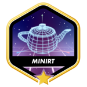

# 📂 42 projects

Thanks to [ayogun](https://github.com/ayogun) for the
[badges/covers](https://github.com/ayogun/42-project-badges/tree/main)!

[C piscine 42](https://github.com/Keisn1/C-piscine-42)

| **Rank 0**                                                 |                                                                           |                                                                              |
|------------------------------------------------------------|---------------------------------------------------------------------------|------------------------------------------------------------------------------|
| [**libft**](https://github.com/Keisn1/libft)               |                                                                           |                                                                              |
|                |                                                                           |                                                                              |
| **Rank 1**                                                 |                                                                           |                                                                              |
| [**ft_printf**](https://github.com/Keisn1/ft_printf)       | [**get_next_line**](https://github.com/Keisn1/get-next-line)              | [**Born 2 be Root**](https://github.com/Keisn1/Born2BeRoot)                  |
|                   |                                    |                                         |
| **Rank 2**                                                 |                                                                           |                                                                              |
| [**Push Swap**](https://github.com/Keisn1/push-swap)       | [**Minitalk**](https://github.com/Keisn1/minitalk)                        | [**Fil de Fer (fdf)**](https://github.com/Keisn1/fdf)                        |
|                   |                                    |                                                 |
| **Rank 3**                                                 |                                                                           |                                                                              |
| [**Philosophers**](https://github.com/Keisn1/philosophers) | [**Minishell**](https://github.com/Keisn1/minishell)                      |                                                                              |
|             |                                  |                                                                              |
| **Rank 4**                                                 |                                                                           |                                                                              |
| [**miniRT**](https://github.com/obluda2173/miniRT)         | [**CPP-modules**](https://github.com/Keisn1/CPP-modules-42) (in progress) | [**net-practice**](https://github.com/Keisn1/net-practice.git) (in progress) |
|                         |                                              |                                 |

| **Rank 4**                                                                   | Description                                                                                                                                                                                                                                                                                                                                           |
|------------------------------------------------------------------------------|-------------------------------------------------------------------------------------------------------------------------------------------------------------------------------------------------------------------------------------------------------------------------------------------------------------------------------------------------------|
| [**miniRT**](https://github.com/obluda2173/miniRT)                           |                                                                                                                                                                                                                                                                                                                                                       |
|                                           | Raytracer                                                                                                                                                                                                                                                                                                                                             |
| [**CPP-modules**](https://github.com/Keisn1/CPP-modules-42) (in progress)    |                                                                                                                                                                                                                                                                                                                                                       |
|                                                 | Building knowledge about C++, Classes, Templates                                                                                                                                                                                                                                                                                                      |
| [**net-practice**](https://github.com/Keisn1/net-practice.git) (in progress) |                                                                                                                                                                                                                                                                                                                                                       |
|                                 | Netpractice is a project at 42 School designed to help students understand network-related issues. The goal is to debug networking problems and learn to identify, analyze, and fix common network configuration errors. This project enhances students' skills in network troubleshooting and improves their understanding of how networks function. |
|                                                                              |                                                                                                                                                                                                                                                                                                                                                       |
